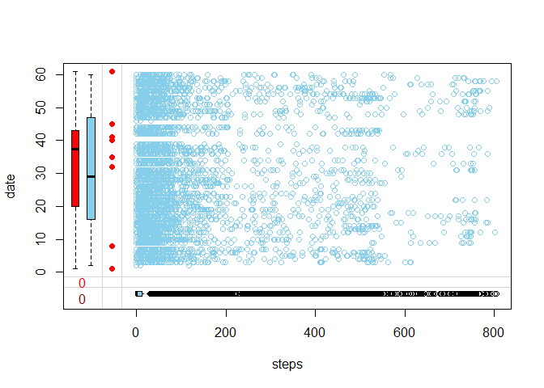
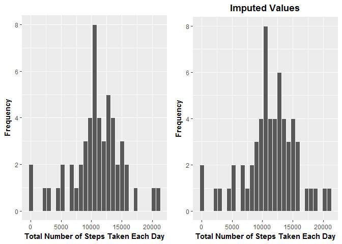
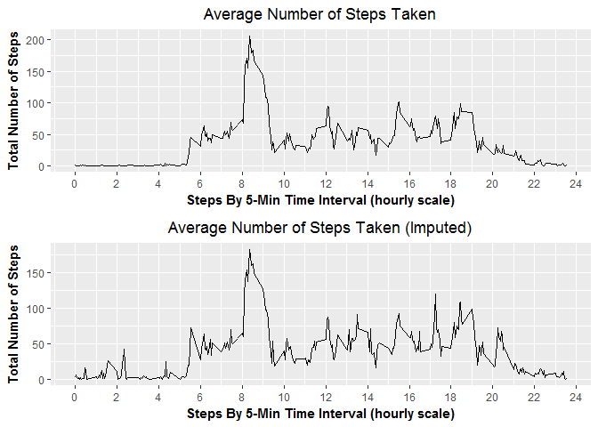
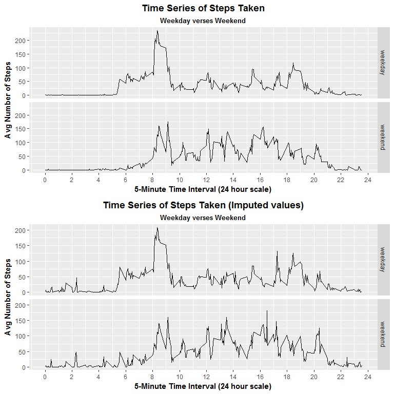

# Reproducible Research: Peer Assessment 1
#### Load Libraries

```r
packages <- c("lubridate", "dplyr", "ggplot2", "RColorBrewer", "mice", "VIM", "grid", "gridExtra")
if (length(setdiff(packages, rownames(installed.packages()))) > 0) {
  install.packages(setdiff(packages, rownames(installed.packages())), repos = "http://cran.us.r-project.org")  
}

library(dplyr)
library(ggplot2)
library(RColorBrewer)
library(mice)
library(VIM)
library(grid)
library(gridExtra)
```

## Loading and preprocessing the data
#### Load the Data containing activity data for October and November 2012

```r
if (!file.exists('./activity.csv')) {
    unzip('./activity.zip')
}

data <- read.csv("./activity.csv", sep = ",", header = TRUE, fill = TRUE)
```
#### Quickly analize the data to see what the values look like

```r
summary(data)
```

```
##      steps                date          interval     
##  Min.   :  0.00   2012-10-01:  288   Min.   :   0.0  
##  1st Qu.:  0.00   2012-10-02:  288   1st Qu.: 588.8  
##  Median :  0.00   2012-10-03:  288   Median :1177.5  
##  Mean   : 37.38   2012-10-04:  288   Mean   :1177.5  
##  3rd Qu.: 12.00   2012-10-05:  288   3rd Qu.:1766.2  
##  Max.   :806.00   2012-10-06:  288   Max.   :2355.0  
##  NA's   :2304     (Other)   :15840
```

#### Give the percentage for each column missing

```r
pMiss <- function(x){sum(is.na(x))/length(x)*100}
apply(data,2,pMiss)
```

```
##    steps     date interval 
## 13.11475  0.00000  0.00000
```

#### Use the mice library to look at missing data patterns

```r
md.pattern(data)
```

```
##       date interval steps     
## 15264    1        1     1    0
##  2304    1        1     0    1
##          0        0  2304 2304
```
  
* The results show the following:
+ 15264 are complete
+ 2304 values are missing from **steps** measurement
  
Give a visual representation using the VIM library.  The graph below demonstrates that all missing values belong to **steps** variable


```r
aggr_plot <- aggr(data, col=c('navyblue','red'),
                  numbers=TRUE, sortVars=TRUE, labels=names(data),
                  cex.axis=.7, gap=3, ylab=c("Histogram of missing data","Pattern"))
```

<!-- -->

```
## 
##  Variables sorted by number of missings: 
##  Variable     Count
##     steps 0.1311475
##      date 0.0000000
##  interval 0.0000000
```


```r
marginplot(data[c(1,2)])
```

<!-- -->
  
*Now that we understand missing values for steps are predominantly at the top, we can assume the person did not start until Oct 2, which was a startup day and the other missing values are days not used.  The data will eliminate October 1 since it will skew all the numbers including any imputation*
  
#### Clean and Transform Data

```r
data <- filter(data, as.Date(date) > '2012-10-01')
data <- data %>% mutate(monthday = format(as.Date(data$date, "%Y-%m-%d"), format = "%m-%d"),
                        dayofweek = weekdays(as.Date(data$date)))
```

## Imputing missing values
* Impute the missing data using mice library 
+ m = number of imputed datasets  
+ meth = 'pmm' refers to the imputation method (predictive mean matching)  
+ maxit = number of interations  
+ seed = the seed to use to autogenerate the random number  
  

```r
workerImputedData <- mice(data,m=5, maxit=5, meth='pmm',seed=500)
head(workerImputedData$imp$steps, 30)
```
  
Select the first data set to use for imputing the values

```r
imputedData <- complete(workerImputedData, 1)
```
  
## What is mean total number of steps taken per day?

#### Aggregate data by Date for both non-imputed and imputed values

```r
stepsPerDay <- data %>%
  select(steps, monthday) %>% 
  filter(steps >= 0) %>% 
  group_by(monthday = as.factor(monthday)) %>% 
  summarize(count = n(), 
            mean = mean(steps, na.rm = TRUE),
            median = median(steps),
            totalSteps = sum(steps, na.rm = TRUE))

stepsPerDayImputed <- imputedData %>% 
  select(steps, monthday) %>% 
  filter(steps >= 0) %>% 
  group_by(monthday = as.factor(monthday)) %>% 
  summarize(count = n(), 
            mean = mean(steps, na.rm = TRUE),
            median = median(steps),
            totalSteps = sum(steps, na.rm = TRUE))
```
  
#### Plot the Histogram of the total number of steps taken each day

```r
histTotalStepsTaken <- ggplot(data = stepsPerDay) + 
  geom_histogram(binwidth = 750, color = "white", aes(totalSteps, fill=totalSteps)) +
  labs(x="Total Number of Steps Taken Each Day", y="Frequency",
       title=" ") +
  theme(legend.position = "none", plot.title = element_text(hjust = 0.5)) +
  theme(axis.title = element_text(face="bold")) +
  scale_fill_brewer(palette = "Dark2")

histTotalStepsTakenImputed <- ggplot(data = stepsPerDayImputed) + 
  geom_histogram(binwidth = 750, color = "white", aes(totalSteps, fill=totalSteps)) +
  labs(x="Total Number of Steps Taken Each Day", y="Frequency",
       title="Imputed Values") +
  theme(legend.position = "none", 
        plot.title = element_text(hjust = 0.5, face = "bold"), 
        plot.subtitle = element_text(hjust = 0.5, face = "bold")) +
  theme(axis.title = element_text(face="bold")) +
  scale_fill_brewer(palette = "Dark2")
```

### Histogram of the Total Number of Steps Taken Each Day

```r
grid.arrange(histTotalStepsTaken,histTotalStepsTakenImputed, ncol = 2)
```

<!-- -->

#### Calculate the mean and median for the total number of steps taken

```r
stepsPerDayMean = format(mean(stepsPerDay$totalSteps), digits = 8)
stepsPerDayMedian = format(median(stepsPerDay$totalSteps), digits = 8)
stepsPerDayMeanImputed = format(mean(stepsPerDayImputed$totalSteps), digits = 8)
stepsPerDayMedianImputed = format(median(stepsPerDayImputed$totalSteps), digits = 8)
```

**Mean:** 10766.189 steps  
**Median:** 10766.189 steps 
**Imputed Mean:** 11286.55 steps  
**Imputed Median:** 11405 steps 
  
## What is the average daily activity pattern?

#### Aggregate data by time interval for both non-imputed and imputed values

```r
stepsPerInterval <- data %>%
  group_by(interval) %>%
  summarise(avgStepsPerInterval = mean(steps, na.rm = TRUE)) %>%
  mutate(hourlyInterval = interval / 100) %>%
  mutate(hour = floor(hourlyInterval), minute = (hourlyInterval - floor(hourlyInterval)) * 100)

stepsPerIntervalImputed <- imputedData %>%
  group_by(interval) %>%
  summarise(avgStepsPerInterval = mean(steps, na.rm = TRUE)) %>%
  mutate(hourlyInterval = interval / 100) %>%
  mutate(hour = floor(hourlyInterval), minute = (hourlyInterval - floor(hourlyInterval)) * 100)
```
  
#### Time series plot of the average number of steps per 5-Min interval

```r
timeseriesavgsteps <- ggplot(data = stepsPerInterval, 
                              aes(x = hourlyInterval, y = avgStepsPerInterval)) + 
  geom_line() +
  labs(x="Steps By 5-Min Time Interval (hourly scale)", y="Total Number of Steps",
       title="Average Number of Steps Taken") + 
  scale_x_continuous(breaks = scales::pretty_breaks(12)) +
  theme(legend.position = "none", plot.title = element_text(hjust = 0.5)) +
  theme(axis.title = element_text(face="bold"))

timeseriesavgstepsimputed <- ggplot(data = stepsPerIntervalImputed, 
                                      aes(x = hourlyInterval, y = avgStepsPerInterval)) + 
  geom_line() +
  labs(x="Steps By 5-Min Time Interval (hourly scale)", y="Total Number of Steps",
       title="Average Number of Steps Taken (Imputed)") + 
  scale_x_continuous(breaks = scales::pretty_breaks(12)) +
  theme(legend.position = "none", plot.title = element_text(hjust = 0.5)) +
  theme(axis.title = element_text(face="bold"))

grid.arrange(timeseriesavgsteps,timeseriesavgstepsimputed, nrow = 2)
```

<!-- -->
  
#### Calculate the 5-minute interval that, on average, contains the maxium number of steps

```r
maxInterval <- which.max(stepsPerInterval$avgStepsPerInterval)
maxTimeInterval <- stepsPerInterval[maxInterval,]
maxTimeIntervalValue <- paste(maxTimeInterval$hour, maxTimeInterval$minute, sep=":")
maxIntervalSteps <- format(maxTimeInterval$avgStepsPerInterval, digits=5)

maxIntervalImputed <- which.max(stepsPerInterval$avgStepsPerInterval)
maxTimeIntervalImputed <- stepsPerInterval[maxInterval,]
maxTimeIntervalValueImputed <- paste(maxTimeInterval$hour, maxTimeInterval$minute, sep=":")
maxIntervalStepsImputed <- format(maxTimeInterval$avgStepsPerInterval, digits=5)
```

##### Max Average Steps in a 5-minute interval
*Non-Imputed*

```r
maxTimeInterval %>% summarize(interval=maxInterval, avgsteps=maxIntervalSteps, time=maxTimeIntervalValue)
```

```
## # A tibble: 1 x 3
##   interval avgsteps  time
##      <int>    <chr> <chr>
## 1      104   206.17  8:35
```

*Imputed*

```r
maxTimeIntervalImputed %>% summarize(interval=maxInterval, avgsteps=maxIntervalSteps, time=maxTimeIntervalValue)
```

```
## # A tibble: 1 x 3
##   interval avgsteps  time
##      <int>    <chr> <chr>
## 1      104   206.17  8:35
```

## Are there differences in activity patterns between weekdays and weekends?

##### Transform data by adding the day type for both data and imputed data

```r
data$daytype <- ifelse(as.POSIXlt(data$date)$wday %in% c(0,6), 'weekend','weekday')
imputedData$daytype <- ifelse(as.POSIXlt(imputedData$date)$wday %in% c(0,6), 'weekend','weekday')
```

##### Aggregate data by interval and daytype and plot showing weekday verses weekend

```r
avgByDaytype <- data %>%
  filter(steps >= 0) %>%
  group_by(interval, daytype) %>%
  summarise(avgStepsPerInterval = mean(steps, na.rm = TRUE)) %>%
  mutate(hourlyInterval = interval / 100) %>%
  mutate(hour = floor(hourlyInterval), minute = (hourlyInterval - floor(hourlyInterval)) * 100)

timeseriesByDaytype <- ggplot(data = avgByDaytype, aes(hourlyInterval, avgStepsPerInterval)) + 
  geom_line() +
  facet_grid(daytype ~ .) +
  scale_x_continuous(breaks = scales::pretty_breaks(12)) +
  labs(x="5-Minute Time Interval (24 hour scale)", y="Avg Number of Steps",
       title="Time Series of Steps Taken",
       subtitle = "Weekday verses Weekend") +
  theme(legend.position = "none", 
        plot.title = element_text(hjust = 0.5, face = "bold"), 
        plot.subtitle = element_text(hjust = 0.5, face = "bold")) +
  theme(axis.title = element_text(face="bold")) +
  scale_fill_brewer(palette = "Dark2")

avgByDaytypeImputed <- imputedData %>%
  filter(steps >= 0) %>%
  group_by(interval, daytype) %>%
  summarise(avgStepsPerInterval = mean(steps, na.rm = TRUE)) %>%
  mutate(hourlyInterval = interval / 100) %>%
  mutate(hour = floor(hourlyInterval), minute = (hourlyInterval - floor(hourlyInterval)) * 100)

timeseriesByDaytypeImputed <- ggplot(data = avgByDaytypeImputed, aes(hourlyInterval, avgStepsPerInterval)) + 
  geom_line() +
  facet_grid(daytype ~ .) +
  scale_x_continuous(breaks = scales::pretty_breaks(12)) +
  labs(x="5-Minute Time Interval (24 hour scale)", y="Avg Number of Steps",
       title="Time Series of Steps Taken (Imputed values)",
       subtitle = "Weekday verses Weekend") +
  theme(legend.position = "none", 
        plot.title = element_text(hjust = 0.5, face = "bold"), 
        plot.subtitle = element_text(hjust = 0.5, face = "bold")) +
  theme(axis.title = element_text(face="bold")) +
  scale_fill_brewer(palette = "Dark2")

grid.arrange(timeseriesByDaytype,timeseriesByDaytypeImputed, nrow = 2)
```

<!-- -->
  
## Summary
**Mean:** 10766.189 steps  
**Median:** 10765 steps  
**Imputed Mean:** 11286.55 steps  
**Imputed Median:** 11405 steps  

The time interval with the most steps taken was at **8:35** am with an average step count of **206.17**  

Using the imputed results skewed the numbers because the person most likely did not walk or walked very little between the hours of 11:00 pm to 5:30 am.  Therefore these values will more than likely be either NA or 0 while sleeping.

The activity started earlier on the weekdays but there was more activity during the hours 7:00 pm to 10:00 pm on the weekends.


